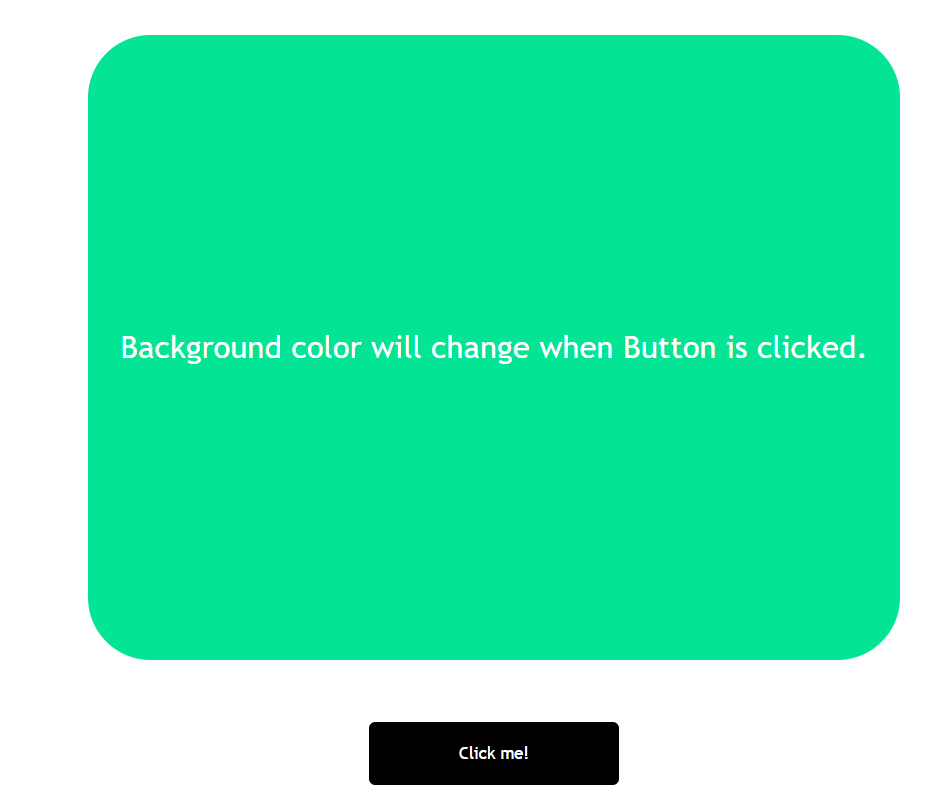

# Javascript Colorchanger Assingment

### Input image

### output 

## Things i have learnt:
1. Understanding javascript and HTML integration.
2. click event listener.

**Time taken**

1.5 hours.

## Deployed link
[Deployed link](https://color-changer-proj.netlify.app/)
